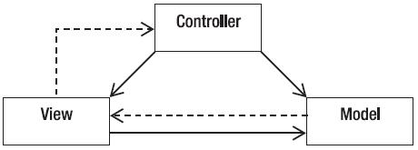
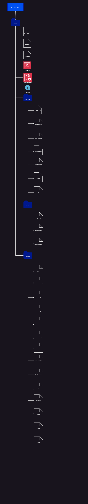

# Arquitetura do projeto SDC
### Projeto feito utilizando padrão arquitetural MVC (Model-View-Controller)
---
## O Padrão MVC (Model-View-Controller):
>O MVC é utilizado em muitos projetos devido a arquitetura que possui, o que possibilita a divisão do projeto em camadas muito bem definidas. Cada uma delas, o Model, o Controller e a View, executa o que lhe é definido e nada mais do que isso.

A utilização do padrão MVC traz como benefício o isolamento das regras de negócios da lógica de apresentação, que é a interface com o usuário. Isto possibilita a existência de várias interfaces com o usuário que podem ser modificadas sem a necessidade de alterar as regras de negócios, proporcionando muito mais flexibilidade e oportunidades de reuso das classes.

Uma das características de um padrão de projeto é poder aplicá-lo em sistemas distintos. O padrão MVC pode ser utilizado em vários tipos de projetos como, por exemplo, desktop, web e mobile.


```
SDC PROJECT/
│
├── SRC/                   # Código da aplicação
│   ├── __init__.py        # Inicializador do pacote
│   ├── main.py            # Arquivo principal da aplicação
│   ├── model/             # Pasta para os modelos
│   │   ├── __init__.py    # Inicializador do pacote
│   │   └──CLEAN_model      # Model
│   │   └──hand_dispenser   # Model
│   │   └──hand_landmarker  # Model
│   │   └──model            # Model
│   │   └──roi              # Model
│   ├── view/              # Pasta para as visões
│   │   ├── __init__.py    # Inicializador do pacote
│   │   └──SanitationStep.py # View
│   │   └──SequentialScreen.py # View
│   │   └──SucessAlert.py  # View
│   ├── img/               # Pasta para imagens
│   │   └──steps_images/   # Pasta para armazenar steps
│   │   └──alertSdc.jpg    # Alert_Success
│   └── controller/        # Pasta para os controladores
│       ├── __init__.py    # Inicializador do pacote
│       └── CameraRealsense.py # Controllers
│       └── Classifer.py   # Controllers
│       └── Dispenser.py   # Controllers
│       └── HandDispenserClassifier.py # Controllers
│       └── HandSanitationProcess.py # Controllers
│       └── LivestreamManager.py # Controllers
│       └── MediapipeFuncionality.py # Controllers
│       └── ScreenFuncionality.py # Controllers
│       └── ScreenInterface.py # Controllers
│       └── SlidingWindow.py # Controllers
│       └── State.py # Controllers
│       └── Timer.py # Controllers
│       └── tools.py # Controllers
│
├── tests/                 # Testes unitários
│   ├── __init__.py        # Inicializador do pacote
│   └── test.py            #Testes
│
├── docs/                  # Documentação
│   └── README.md          # Arquivo README
│   └── Project Architecture.md # Arquitetura do projeto
│
├── .gitignore             # Arquivos e pastas ignorados pelo Git
├── requirements.txt       # Dependências do projeto
└── setup.py               # Script de instalação
```

{/* ---
 */}