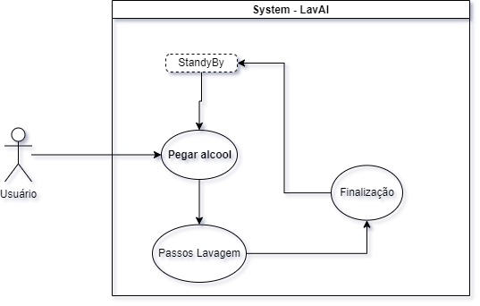

# Casos de Uso

**Figura 1:** Diagrama de casos de uso -SDC LAVAI.

---

**CASO DE USO:** Utilizando

**Descrição:** o caso de uso inicia-se quando o usuário pega o alcool com algumas das duas mãos.

**Ator primário:** Usuário.

**Cenário principal:**

- Usuario ira pegar o alcool com alguma das mãos.

- o Sistema vai inicializar indicando na tela quais movimentos proceder.

**Pós condições:**

- Usuario vai finalizar o procedimento de um lado das mãos.
- Usuario pegarar o Alcool com a proxima mão a ser higienizada.
- Usuario vai finalizar o procedimento com  o outro lado das mãos.
- Usuario pegar novamente alcool com qualquer lado das mãos.
- Usuario vai finalizar a lavagem dos braços.

**Cenário de exceção:**

- Apos alguns minutos de inutilização o sistema reinicia ao começo 

---